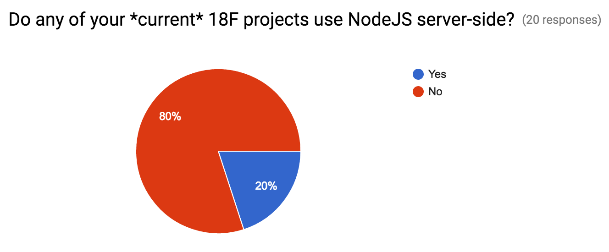
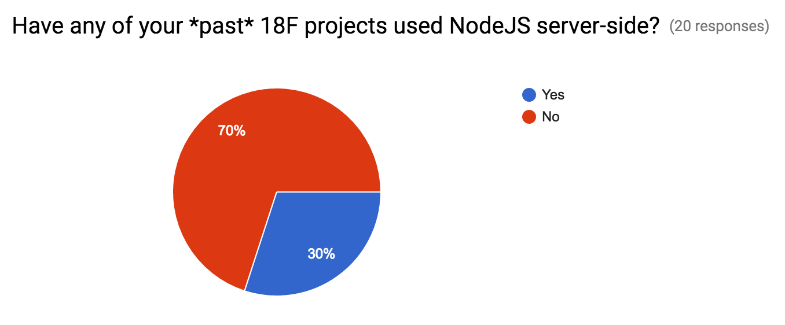
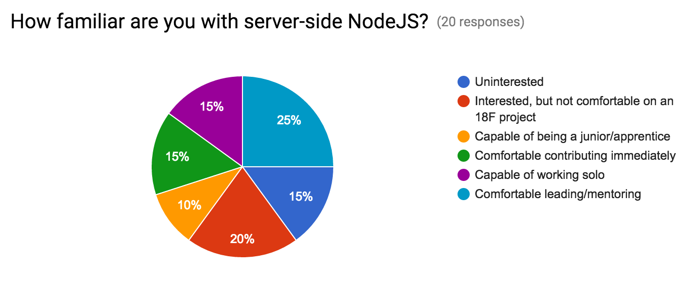
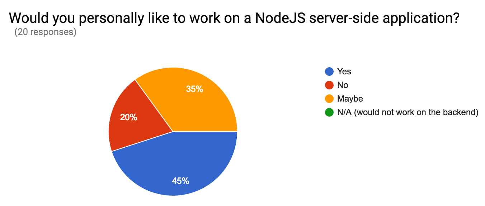
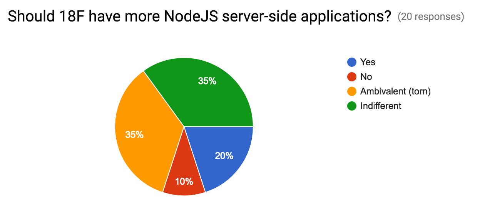

In preparation for a discussion about whether we should try to encourage or
discourage backend NodeJS apps, we created a brief survey about NodeJS backend
usage. We received 17 responses of roughly 80 solicited.

## 18F projects

Most engineers have not worked on server-side NodeJS projects at 18F and
particularly not at present. We can group the projects folks mentioned into a
few categories:

### Internal tools

* [far-clauses](https://github.com/18F/far-clauses-tool)
* [standup-bot](https://github.com/18F/standup-slack-bot)
* [checklistomania](https://github.com/18F/checklistomania)
* [air-traffic-control](https://github.com/18F/internal-air-traffic-control)
* [acq-trello](https://github.com/18F/acq-trello-listener)
* [team-api-server](https://github.com/18F/team-api-server)
* Hubot scripts (CoffeeScript)

### Platforms

* [cf-abacus](https://github.com/18F/cf-abacus)
* [logsearch-for-cloudfoundry](https://github.com/18F/logsearch-for-cloudfoundry)
* Several cloud.gov components
* api.data.gov (no longer uses Node)
* [federalist](https://github.com/18F/federalist)

### Partner/handoff solutions

* [open opportunities](https://github.com/18F/openopps-platform)
* communicart (no longer uses Node)

## Familiarity

More than 65% of responders felt they could work on a NodeJS project at 18F
while a quarter would be willing to lead or mentor.

## Going forward

A slight majority of responders want to work on NodeJS server-side projects,
with a heavy chunk that could be convinced. The breakdown as to whether 18F
should have more of these apps is a bit different. Only a fifth of responders
felt we should clearly work on more server-side JS. This is double the number
who want us to avoid it. The majority are indifferent or torn (split equally)
on the topic. Let's look at reasons why engineers say they responded this way.

### Yes

Responders in this camp described the benefits of NodeJS on the backend in the
abstract:

* Easy testing, packaging, deployment
* Rich libraries, particularly for web apps
* JS is the lingua franca for web developers, meaning more contributors
* Frontend devs can contribute to backend and vis versa more easily
* Event-driven IO matches the workflow of API servers, adapters, and proxies

### No

The major reason cited in this response was a preference against JavaScript
("eval and all the terrible things on the client side") and in favor of
other languages ("Golang and python better alternatives").

### Indifferent

Responders who voted "indifferent" shared a concern 18F shouldn't have a
stance in general -- "use the best tool for the job". Some in this group were
particularly concerned that they would be **forced** to use NodeJS and noted
they had not felt productive in that environment. This group recognized that
NodeJS is popular enough that it would behoove us to pay it some mind. One
commenter described NodeJS as a good fit for _certain_ types of projects
(particularly isomorphic JS) and real-time apps but that the ecosystem isn't
as mature nor as secure as Ruby nor Python.

### Ambivalent

As expected, the "ambivalent (torn)" crowd had the most to say. The group
noted benefits of server-side JS:

* A single language across the stack
* Popular choice with an active community
* Blazing fast with a smaller resource footprint
* Great for building APIs or small applications
* Isomorphic JS resolves some progressive enhancement issues
* Skillset worth having

but lamented the risks:

* Pace of development (lack of stability, maintenance nightmare)
* Novelty leading to lack of best-practices (particularly around security)
* Asynchronous design requires rethinking app architecture
* Building large, CRUD apps is not its strong suite
* Difficult to hand off to partner agencies
* Community doesn't value rigor (lack of good type safety,
  easy-to-introduce show-stopping bugs, missing standard project layouts,
  etc.)

We could probably summarize this group's responses by saying server-side JS
has potential, but has lots of thorns which are difficult to avoid.
